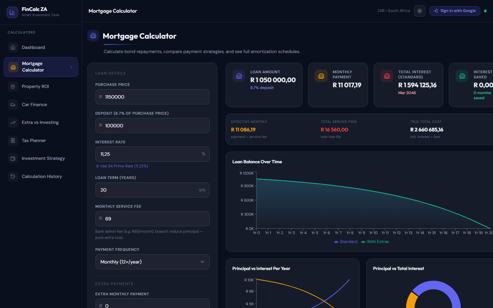
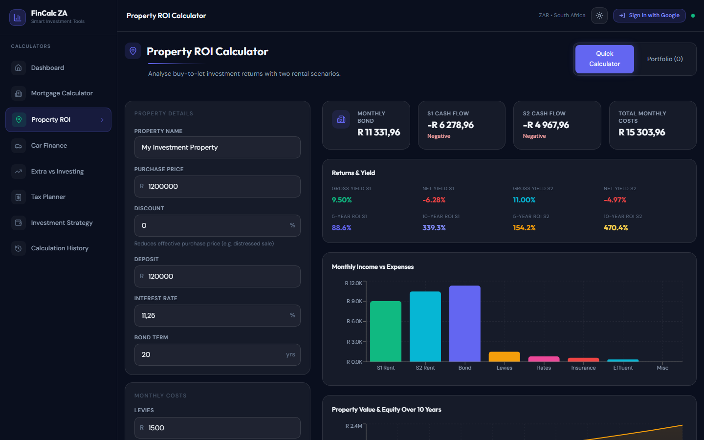
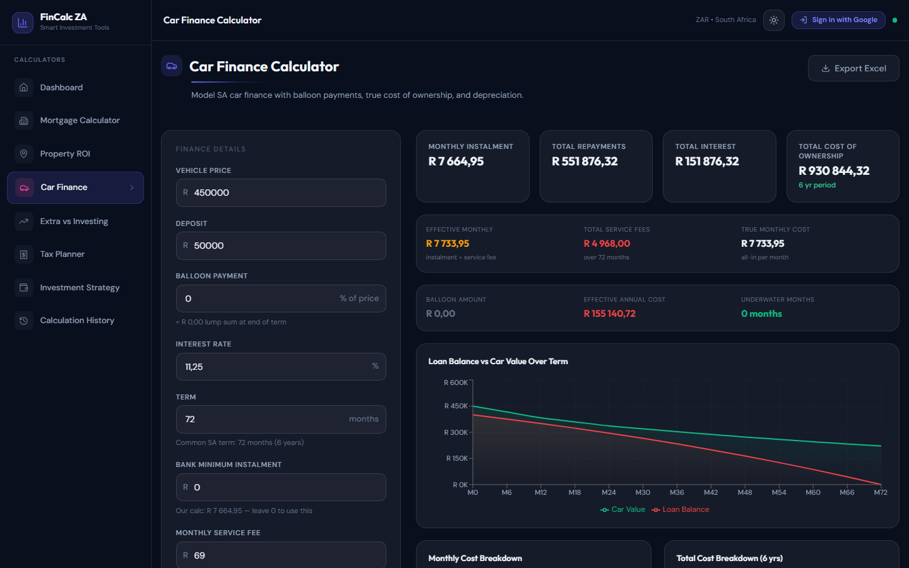
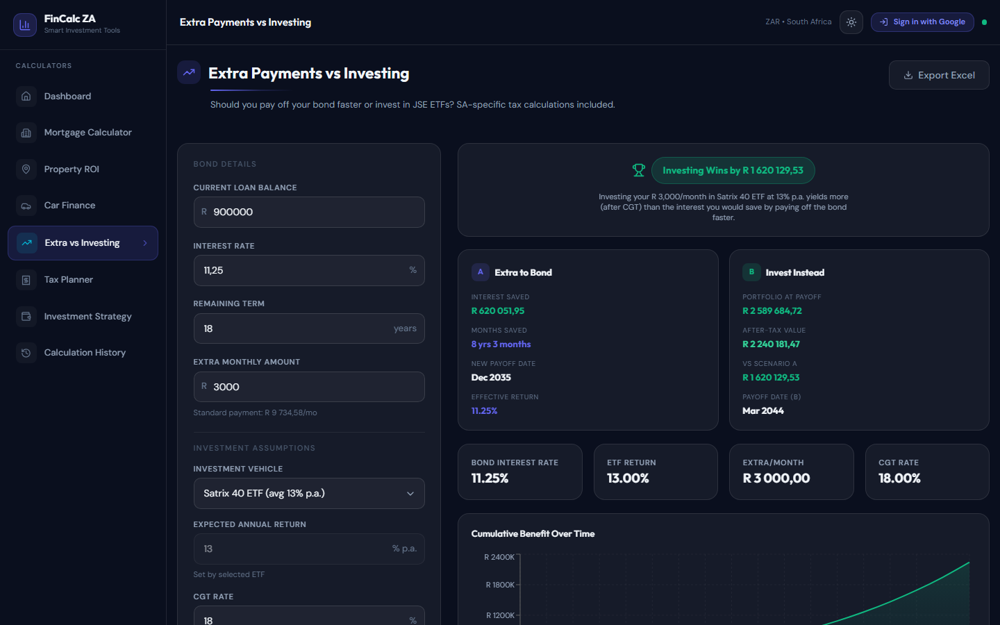
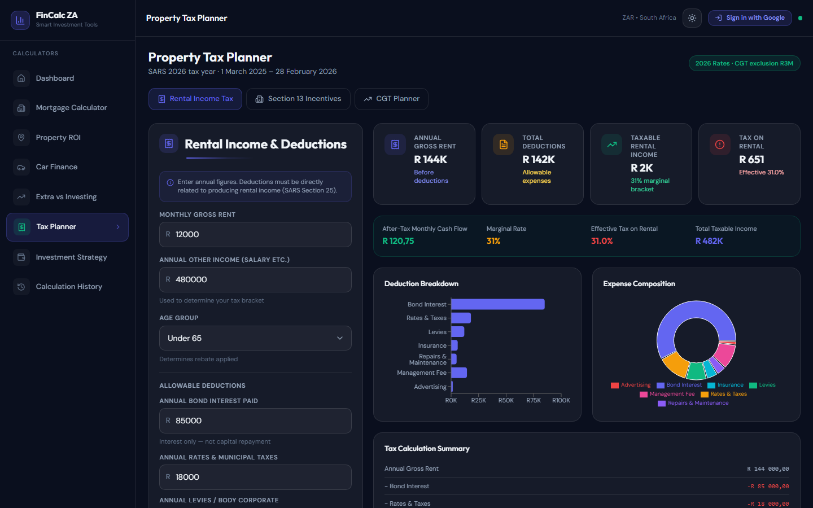
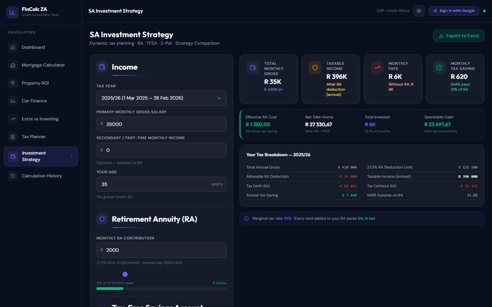

# FinCalc ZA

> **Smart Investment Tools for South African Investors**
> A production-grade, dark-themed financial calculator suite built with React + TypeScript + Vite. Covers mortgages, buy-to-let property ROI, car finance, the classic extra-payment vs. investing dilemma, SA tax planning, and investment strategy — all calibrated for South African conditions (ZAR, Prime Rate, JSE ETFs, CGT, SARS tax brackets).

---

## Screenshots

| Dashboard (Dark) | Dashboard (Light) |
|---|---|
|  |  |

| Mortgage Calculator | Property ROI |
|---|---|
|  |  |

| Car Finance | Extra Payments vs Investing |
|---|---|
|  |  |

| Tax Planner | Investment Strategy |
|---|---|
|  |  |

| Calculation History | Light Mode |
|---|---|
|  |  |
---

## Features

### Mortgage Calculator
- Annuity-formula bond repayment (monthly & bi-weekly)
- Extra monthly payments + once-off lump-sum injection
- Full amortization schedule (collapsible, paginated)
- Interest saved & months saved vs. standard schedule
- Monthly bank service fee with true total-cost banner
- Payoff date projection with and without extras
- Excel (XLSX) export of the full schedule
- Save & load snapshots (Google sign-in required)

### Property ROI Calculator
- Dual rental scenario comparison (conservative vs. optimistic)
- Vacancy rate adjustment
- Management fee (% of effective rent)
- Full cost breakdown: bond repayment, levies, rates, insurance, effluent fees, misc fees
- Gross yield, net yield, 5-year ROI, 10-year ROI
- Property value + equity growth chart (10 years)
- Income vs. Expenses bar chart
- Cost composition pie chart
- **Portfolio Manager**: save multiple properties, compare side-by-side, bulk Excel export
- Edit saved portfolio properties — loads back into calculator with one click
- Cloud sync when signed in (Firestore); localStorage fallback when offline

### Car Finance Calculator
- Balloon payment support (common SA practice)
- Bank-quoted minimum instalment override with warning banner
- Monthly service fee (e.g. Wesbank R69/month)
- Extra monthly payment with interest-saved & months-saved summary
- Depreciation schedule (Year 1: 15%, Year 2: 12%, Year 3+: 10%)
- Underwater months detection (loan balance > vehicle value)
- Opportunity cost comparison: cash purchase vs. financed
- Full amortization table — Standard & With Extras tabs, paginated
- Save & load snapshots (Google sign-in required)

### Extra Payments vs. JSE ETF Investing
- Side-by-side: paying extra into your bond vs. investing the same amount
- JSE ETF benchmarks: Satrix 40 (13%), S&P 500 ETF (18%), Sygnia Itrix (15%), Ashburton (14%), Coronation (12%)
- South African CGT: 18% effective rate (40% inclusion × 45% marginal)
- Inflation-adjusted comparison
- Year-by-year table showing bond balance (both scenarios) and portfolio value
- Clear winner callout with rand advantage
- Save & load snapshots (Google sign-in required)

### Tax Planner
- SARS 2024/25 income tax brackets
- Medical aid credits (principal + dependants)
- Retirement annuity (RA) and pension fund deduction modelling
- Monthly and annual tax breakdown
- Net take-home pay after all deductions
- Save & load snapshots (Google sign-in required)

### Investment Strategy Calculator
- Gross-to-net salary breakdown with PAYE, UIF, SDL
- RA vs. TFSA vs. direct ETF contribution optimisation
- Monthly tax saving from RA contributions
- Recommended strategy tag based on income and goals
- Save & load snapshots (Google sign-in required)

### Calculation History
- All saved snapshots from every calculator in one place
- Open any snapshot — navigates to the correct calculator and restores all inputs in "Edit" mode so you can update and save back
- Delete individual entries or clear all history
- Automatically populated when saving from any calculator

### Save / Load Snapshots (all calculators)
- **Google sign-in** — one-click Google Auth via Firebase
- **Save snapshot** — captures current inputs + key result as a named entry
- **Edit mode** — click Edit on any saved entry to load its inputs and switch the Save button to "Update snapshot", overwriting the same Firestore document
- **Rename** — inline title editing without touching inputs
- **New** button — exit edit mode to save a brand-new snapshot instead of updating
- Snapshots persist in Firestore, synced across devices

### App-wide
- Dark/light mode toggle — persisted to `localStorage`
- Responsive layout: desktop sidebar + mobile bottom tab bar
- Glassmorphism dark theme (#0A0F1E, indigo/amber palette)
- Framer Motion page transitions and card animations
- South African Rand (ZAR) formatting throughout
- Prime Rate displayed in sidebar footer (11.25%)
- Disclaimer banner with full legal text

---

## Tech Stack

| Layer | Library | Version |
|---|---|---|
| Build | Vite | 8.x |
| UI Framework | React | 19.x |
| Language | TypeScript | 5.x (strict) |
| Styling | Tailwind CSS v4 | 4.x (CSS-only config) |
| Component Library | DaisyUI | 5.x |
| Routing | React Router | 7.x |
| Charts | Recharts | 2.x |
| Animations | Framer Motion | 11.x |
| Icons | Lucide React | latest |
| Excel Export | SheetJS (xlsx) | latest |
| Auth | Firebase Auth (Google) | 11.x |
| Database | Firebase Firestore | 11.x |
| CSS Utilities | clsx | latest |

---

## Project Structure

```
src/
├── components/
│   ├── Layout/
│   │   └── AppShell.tsx        # Sidebar, header, mobile nav, theme toggle, auth pill
│   └── ui/
│       ├── InputField.tsx      # Labelled number/text input with prefix/suffix
│       ├── SelectField.tsx     # Styled select dropdown
│       ├── StatCard.tsx        # Metric card with icon and trend
│       ├── SectionHeader.tsx   # Section heading with optional icon
│       └── SaveLoadBar.tsx     # Reusable save/load/edit panel for all calculators
├── context/
│   └── AuthContext.tsx         # Firebase Auth provider (Google sign-in)
├── hooks/
│   └── useFirestore.ts         # useSavedProperties + useHistory Firestore hooks
├── lib/
│   └── firebase.ts             # Firebase app + Firestore + Auth initialisation
├── pages/
│   ├── Dashboard.tsx           # Overview landing page
│   ├── MortgageCalculator.tsx
│   ├── PropertyROI.tsx         # Includes portfolio manager + cloud sync
│   ├── CarFinance.tsx
│   ├── PaymentVsInvesting.tsx
│   ├── TaxPlanner.tsx
│   ├── InvestmentStrategy.tsx
│   └── History.tsx             # Unified calculation history with Open/Delete
├── utils/
│   ├── mortgage.ts             # Bond maths (annuity, amortization, lump sum)
│   ├── roi.ts                  # Property ROI, yields, equity projections
│   ├── car.ts                  # Car finance, balloon, depreciation, underwater
│   ├── investing.ts            # Extra vs. invest comparison, CGT adjustment
│   ├── tax.ts                  # SARS tax brackets, medical credits, RA deductions
│   └── format.ts               # ZAR, percent, date formatters
├── types/
│   └── index.ts                # All TypeScript interfaces
├── App.tsx                     # React Router route definitions
├── main.tsx                    # Entry point
└── index.css                   # Tailwind v4 + DaisyUI + CSS custom properties
```

---

## Getting Started

### Prerequisites
- Node.js 20+
- npm 10+
- A Firebase project (for Auth + Firestore — see below)

### Installation

```bash
git clone https://github.com/Sash3n/investment_calculator.git
cd investment_calculator
npm install
```

### Firebase Setup

1. Create a project at [console.firebase.google.com](https://console.firebase.google.com)
2. Enable **Google sign-in** under Authentication → Sign-in methods
3. Create a **Firestore database** (production mode)
4. Set Firestore rules:
   ```
   rules_version = '2';
   service cloud.firestore {
     match /databases/{database}/documents {
       match /users/{userId}/{document=**} {
         allow read, write: if request.auth != null && request.auth.uid == userId;
       }
     }
   }
   ```
5. Register a web app and copy the config into `.env.local`:
   ```
   VITE_FIREBASE_API_KEY=...
   VITE_FIREBASE_AUTH_DOMAIN=...
   VITE_FIREBASE_PROJECT_ID=...
   VITE_FIREBASE_STORAGE_BUCKET=...
   VITE_FIREBASE_MESSAGING_SENDER_ID=...
   VITE_FIREBASE_APP_ID=...
   ```

### Run

```bash
npm run dev
```

Open [http://localhost:5173](http://localhost:5173)

### Build for Production

```bash
npm run build
npm run preview
```

### Regenerate Screenshots

```bash
npm install --save-dev playwright
npx playwright install chromium
node scripts/screenshot.mjs
```

---

## South Africa–Specific Defaults

| Parameter | Default | Notes |
|---|---|---|
| Prime Rate | 11.25% | As of early 2025 |
| Bank service fee | R69/month | Typical bond admin fee |
| CGT effective rate | 18% | 40% inclusion × 45% marginal rate |
| Vacancy rate | 8% | ~1 month/year industry estimate |
| Management fee | 10% | Letting agent standard |
| Annual appreciation | 5% | Long-run SA property average |
| Effluent fees | R350/month | Municipal sewage charge |

---

## Key Financial Formulas

### Bond Repayment (PMT)
```
PMT = PV × [r(1+r)^n] / [(1+r)^n - 1]

where:
  PV = loan amount
  r  = monthly interest rate (annual rate / 12)
  n  = total number of payments (years × 12)
```

### Gross Rental Yield
```
Gross Yield = (Annual Rent / Purchase Price) × 100
```

### Net Cash Flow
```
Effective Rent = Monthly Rent × (1 - Vacancy Rate)
Management Fee = Effective Rent × Management Fee %
Cash Flow = Effective Rent - Bond Repayment - Levies - Rates
           - Insurance - Effluent - Misc - Management Fee
```

### ROI (5 / 10 Year)
```
Capital Gain   = Future Value - Purchase Price
Total Return   = Capital Gain + (Monthly Cash Flow × 12 × Years)
ROI %          = (Total Return / Deposit) × 100
```

### Car Finance with Balloon
```
Financed Amount = Loan Amount - Balloon Amount
Monthly PMT     = annuity(Financed Amount, rate, term)
Effective PMT   = max(Calculated PMT, Bank Minimum)
```

---

## Git Flow

```
main          ← stable releases
  └── dev     ← integration branch
        └── feature/*  ← individual features
```

Branches merged to `dev` then promoted to `main` for releases.

---

## Roadmap / Future Enhancements

- [x] **Google Auth + Cloud Sync** — sign in with Google to persist snapshots and portfolios across devices
- [x] **Calculation History** — unified history page with open/edit/delete per entry
- [x] **Investment Strategy Calculator** — RA vs. TFSA vs. ETF optimisation with tax saving
- [x] **Tax Planner** — SARS brackets, medical credits, RA deductions
- [ ] **Transfer duty calculator** integrated into Property ROI acquisition costs
- [ ] **Live Prime Rate feed** from SARB API
- [ ] **PDF export** for shareable reports (jsPDF)
- [ ] **Shareable report links** — generate a URL that restores a specific snapshot
- [ ] **Currency selector** for USD/EUR expats
- [ ] **Sectional Title vs. Full-Title** comparison mode in Property ROI
- [ ] **Multi-currency mortgage** — rand-denominated bond on foreign-currency property

---

## License

MIT — free to use, modify, and distribute.

---

*Built for South African investors. All calculations are for informational purposes only and do not constitute financial advice.*
